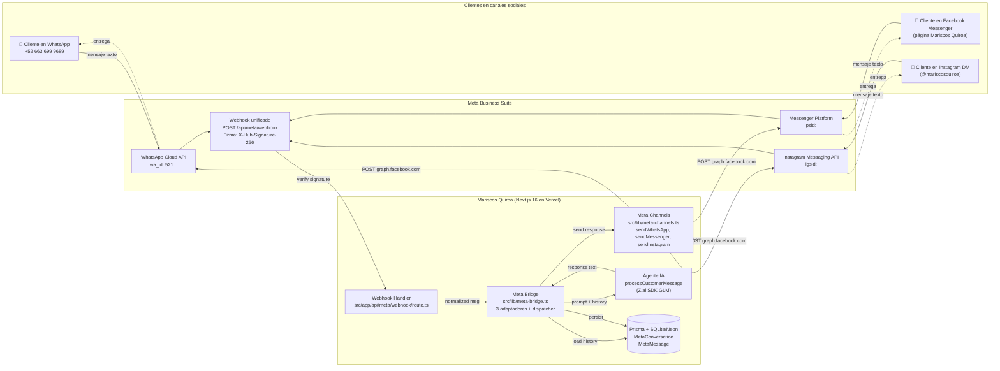
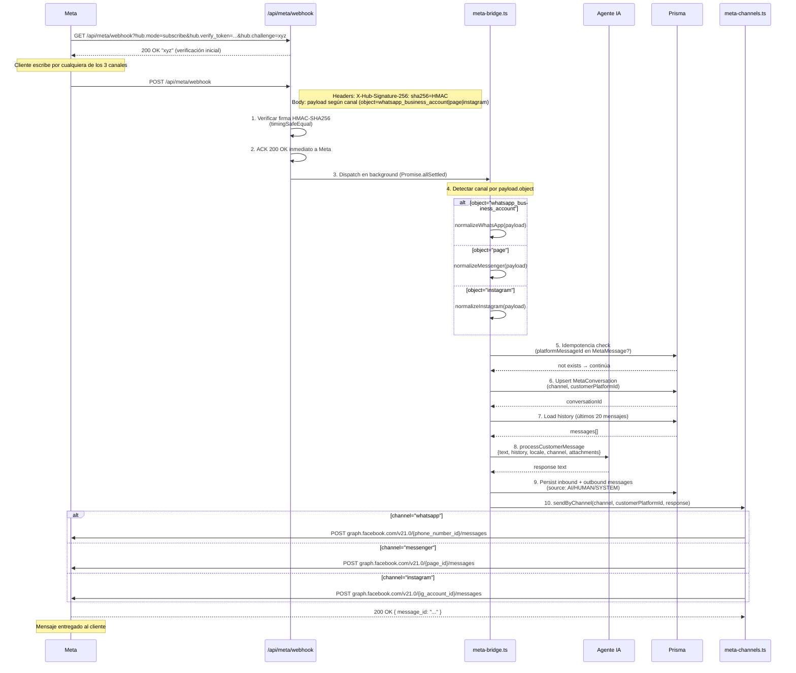
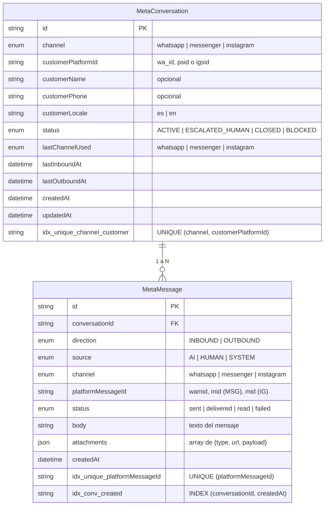
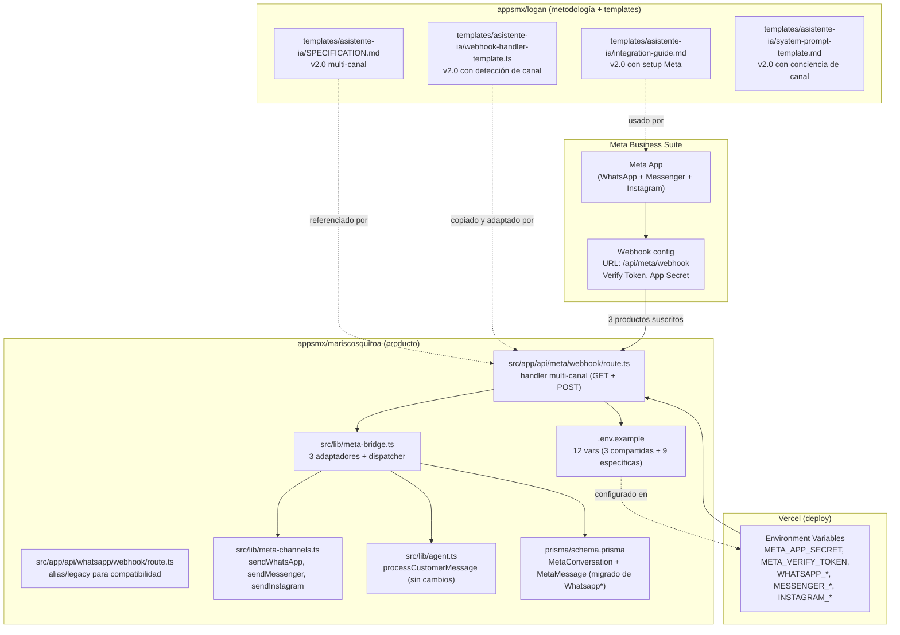
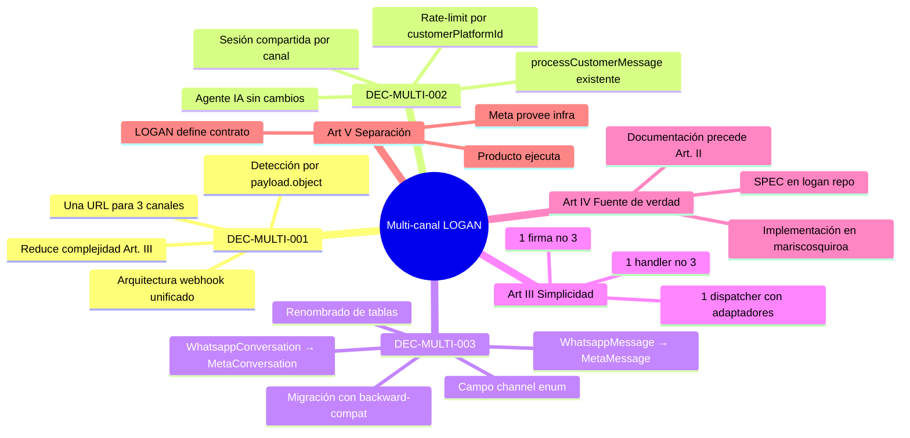
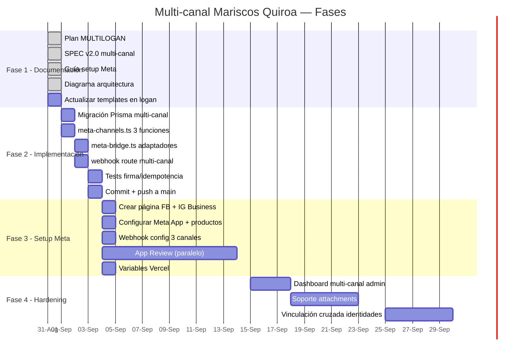
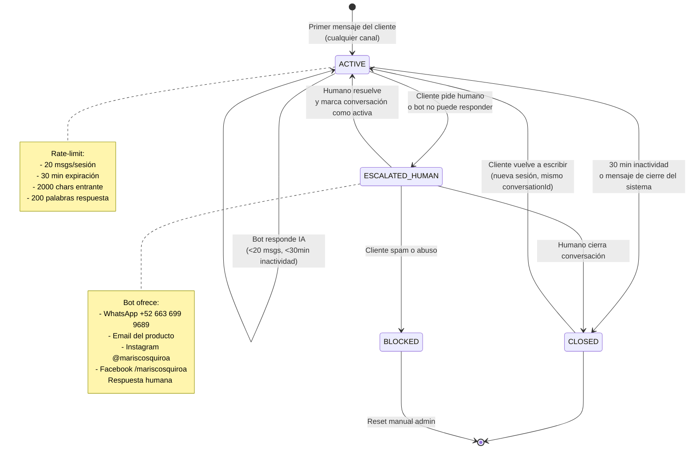
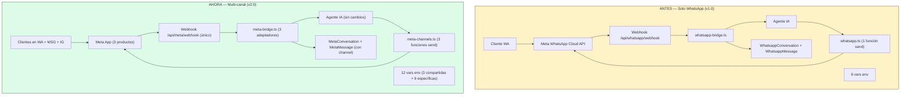
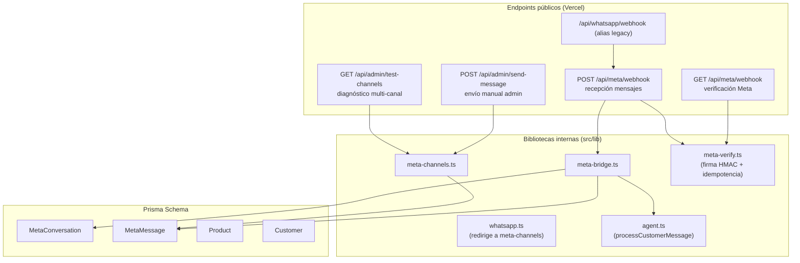

# Arquitectura Multi-canal LOGAN — Diagramas

> **Proyecto:** Mariscos Quiroa (piloto LOGAN)
> **Metodología:** LOGAN v1.0
> **Decisión asociada:** DEC-MULTI-001 (arquitectura webhook unificado)
> **Fecha:** 2026-08-31

Diagramas Mermaid para visualizar la arquitectura completa del Asistente IA multi-canal.

---

## 1. Diagrama de alto nivel (cliente → Meta → Producto)

---

## 2. Flujo detallado del webhook handler

---

## 3. Modelo de datos (Prisma schema multi-canal)

---

## 4. Estructura de archivos en el repositorio

---

## 5. Decisiones LOGAN (DEC-MULTI-001 a 003)

---

## 6. Fases del proyecto (línea de tiempo)

---

## 7. Flujo de estados de una conversación

---

## 8. Comparación: antes (solo WhatsApp) vs ahora (multi-canal)

---

## 9. Mapa de endpoints y archivos

---

## 10. Decisiones LOGAN asociadas

| ID | Decisión | Status |
|---|---|---|
| DEC-LOGAN-004 | El Asistente IA NO registra hipótesis | ✅ Se mantiene |
| DEC-LOGAN-011 | Módulos viven en `templates/` | ✅ Se actualiza SPEC v2.0 |
| DEC-LOGAN-013 | Vercel Pro si timeout 10s no basta | ⏳ Se reevaluará en Fase 2 |
| DEC-LOGAN-016 | logancorp.mx como dominio corporativo | N/A (es de LOGAN OS, no de MQ) |
| DEC-LOGAN-017 | Mix de modelos GLM según criticidad | ✅ Agente IA usa GLM-5-turbo (tier barato) |
| **DEC-MULTI-001** | **Arquitectura webhook unificado multi-canal** | ✅ Nueva |
| **DEC-MULTI-002** | **Agente IA sin cambios en multi-canal** | ✅ Nueva |
| **DEC-MULTI-003** | **Renombrado de tablas + campo channel** | ✅ Nueva |

---

*Diagramas bajo metodología LOGAN v1.0.*
*Art. III (simplicidad) — una sola URL, un solo handler, un solo dispatcher.*
*Art. IV (una sola fuente de verdad) — los diagramas viven en el repo del producto, el SPEC en `appsmx/logan`.*
